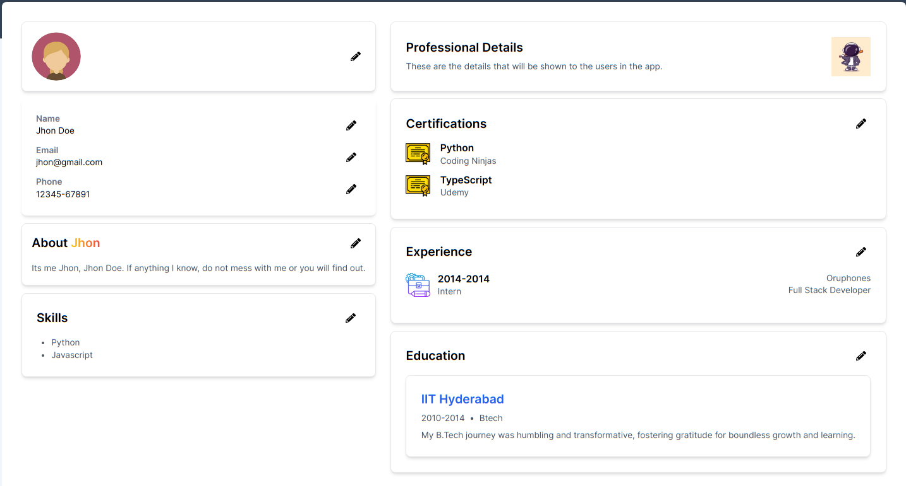
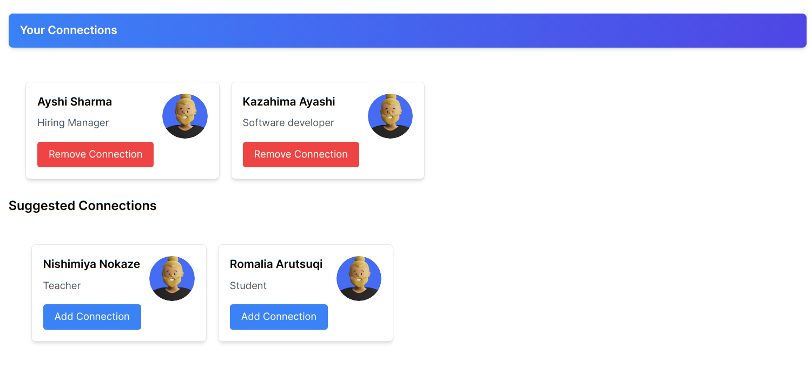

# NextJs Full-Stack Website

[Go to live deployment](https://assignment-01-delta.vercel.app/)

Hi, this is an assignment I was told to do for an internship position.

Welcome to NextJs Full-Stack Website! This project is a web application built using React, Next.js, Tailwind CSS, TypeScript, and MongoDB. It provides a platform for users to create and manage their profiles, connections, and suggested connections.

## Table of Contents

- [Installation](#installation)
- [Usage](#usage)
- [Features](#features)
- [Screenshots](#screenshots)
- [Assignment Instructions](#assignment-instructions)
- [Todos](#todos)
- [Technologies Used](#technologies-used)
- [Contributing](#contributing)
- [Contact Information](#contact-information)

## Installation

1. Clone the repository: `git clone https://github.com/amuwal/assignment-01`
2. Navigate to the project directory: `cd assignment-01`
3. Install dependencies: `npm install`

## Usage

1. Run the project locally: `npm run dev`
2. Access the application in your browser: [http://localhost:3000](http://localhost:3000)

## Features

- **Login and Signup**: Secure login and registration functionality with validation and error handling.

- **Profile Page:**
  The Profile Page displays user details and provides the ability to edit each detail. Any edits made will be immediately updated in the database.

  - **Edit User Details:**
    Users can modify their profile information, such as name, occupation, and profile picture.

- **Connections and Suggested Connections:**
  The Connections page showcases your existing connections and suggested connections. You can remove connections and add suggested connections, with changes reflected in the database.

  - **Manage Connections:**
    Easily remove connections from your network.

  - **Suggested Connections:**
    Explore and add new connections from the suggested list.

- **Responsive Design**: Enjoy a mobile-friendly and responsive experience across various devices, ensuring optimal usability.

## Screenshots

## Assignment Instructions

For detailed assignment instructions, please refer to the [Assignment Instructions Document](https://drive.google.com/drive/folders/11DUW6g9ydPnCjT7RKTrdTTBNddtg71VV?usp=sharing).

## Todos

- Enhance codebase for improved clarity and conciseness.
- Implement Redis caching to optimize data retrieval.
- Refine spinner usage for seamless loading animations.
- Further enhance UI and UX design for a polished user experience.

## Technologies Used

- React
- Next.js
- Tailwind CSS
- TypeScript
- MongoDB

## Contributing

1. Fork the repository.
2. Create a new branch for your feature: `git checkout -b feature-name`
3. Commit your changes: `git commit -m 'Add some feature'`
4. Push to the branch: `git push origin feature-name`
5. Create a pull request.

## Contact Information

For any questions or feedback, please contact [my email](1mitccc@gmail.com).
